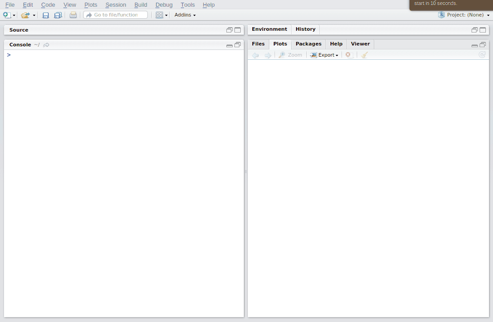
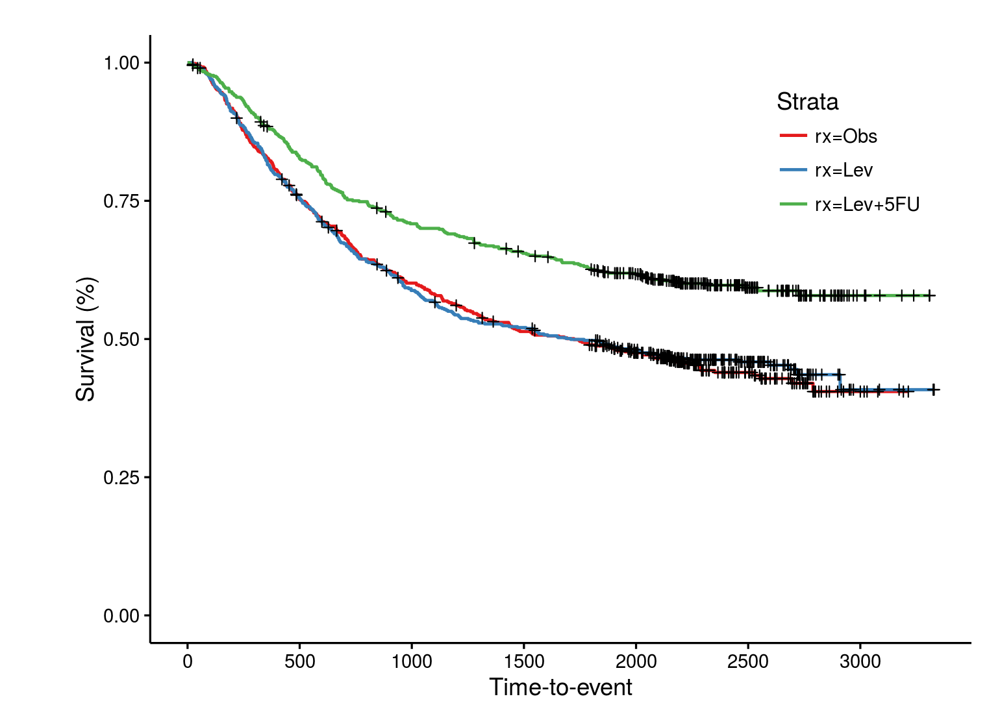
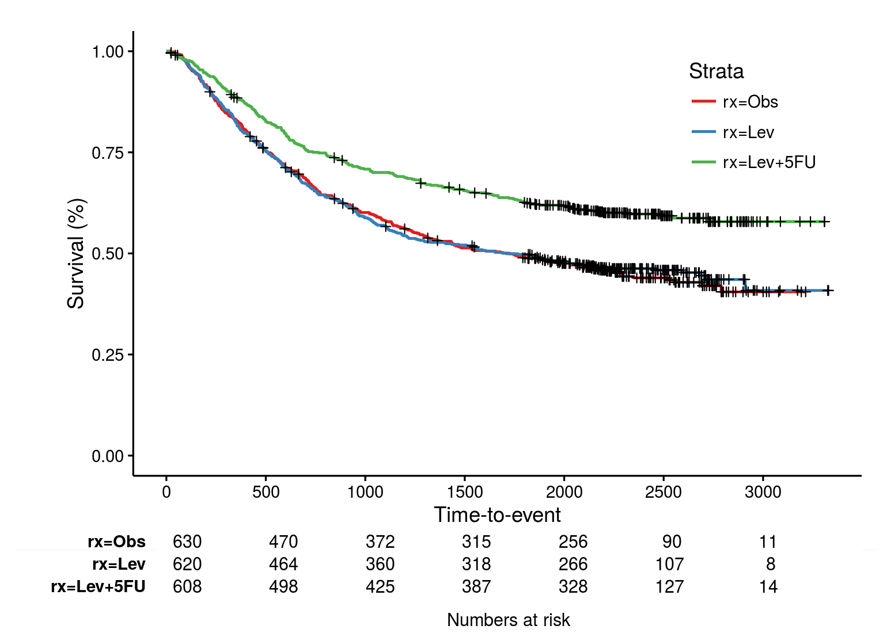
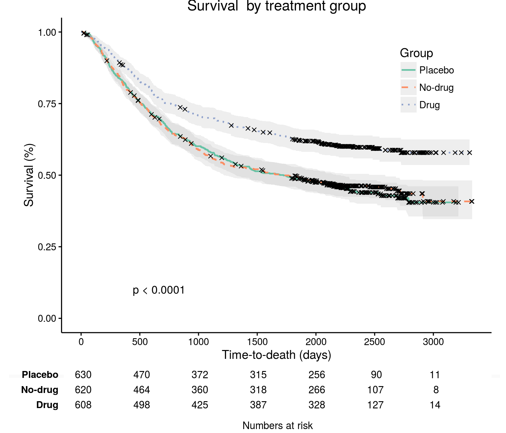

# ggkm
Create publication quality Kaplan-Meier plots with at risk tables below.



##Install

To install the ggkm package, install and run the devtools package and then run the code below in a R console:

```
install.packages("devtools")
library(devtools)
install_github("michaelway/ggkm")
library(ggkm)
```

### Examples

#### Basic Kaplan-Meier Plot

Loading the "colon" dataset from the survival package allows us to create a survival object to plot with the ggkm() function.  A basic Kaplan-Meier plot can be created and saved by running the commands below:

```
#Load dataset

library(survival)
data(colon)
fit <- survfit(Surv(time,status)~rx, data=colon)

#Plot the data
ggkm(fit)

#Save a PNG image using R plotting device
png("KM1.png", units='in', height=5, width=7, res = 220)
ggkm(fit)
dev.off()
```




#### Basic Kaplan-Meier plot with at-risk table

At risk tables are a handy way of demonstrating the number of individuals remaining at each time-point of a survival analysis. This can easily be added by including the parameter "table = TRUE", as below:

```
ggkm(fit, table = TRUE)
```




#### Customise it!

More advanced plots can be created by modifying a number of parameters.  For example the title, y-strata name and lables, x-strata name can all be modified; a 95% confidence interval can be added; the dashtype can be removed or the symbol changed; and, a P-value from the survival object may also be included.

```
ggkm(fit, table = T, 
     main="Survival  by treatment group", 
     ystratalabs = c("Placebo", "No-drug", "Drug"),
     ystrataname = "Group",
     xlabs = "Time-to-death (days)",
     dashed=TRUE,
     pval=TRUE,
     ci=TRUE,
     shape = 4,
     linecols = "Set2")

```



### Points

The marker points which can be modified based on the the numbering of the point symbols given in the image below.


### Colours

The colours of the lines are based on colour brewer palletes.  To set a pallete use a palette name shown in the image below.


#Feedback

This work builds upon that of many others, predominantly Abhijit Dasgupta, Abhijit Dasgupta, Gil Tomas and Mark Crowley at https://statbandit.wordpress.com/2011/03/08/an-enhanced-kaplan-meier-plot/. I have packaged it up and extensively modified the parameters for ease of use.

I would love to hear any feedback, comments or suggestions for this package.

